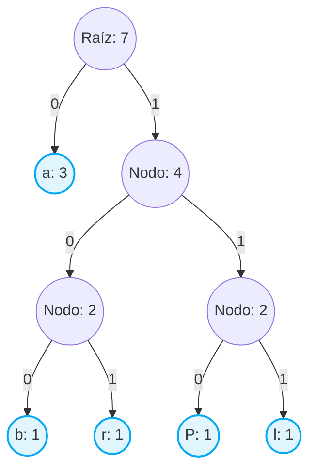

# 🗜️ Compresor de Archivos de Texto (.txt) - Algoritmo de Huffman

**Materia:** Programación Estructurada  
**Lenguaje:** C  

Este documento define la base teórica y técnica de nuestro proyecto de compresión de archivos. Utilizaremos el **Algoritmo de Huffman**, un método de compresión sin pérdida basado en la codificación de longitud variable.

---

## 📌 1. El Problema y la Solución
En un archivo `.txt` estándar, cada carácter (letra, espacio, símbolo) ocupa **1 byte (8 bits)** de memoria, sin importar si aparece una vez o mil veces. 

La solución que implementaremos con Huffman consiste en:
* Asignar secuencias de bits **cortas** a los caracteres que **más se repiten**.
* Asignar secuencias de bits **largas** a los caracteres que **menos se repiten**.

---

## 📊 2. Fase 1: Tabla de Frecuencias
El programa debe leer el archivo `.txt` original y contar las ocurrencias de cada carácter.

**Ejemplo de prueba con la cadena: `Palabra`**

| Carácter | Frecuencia | Peso Inicial |
|:---:|:---:|:---:|
| `a` | 3 | Alto |
| `P` | 1 | Bajo |
| `l` | 1 | Bajo |
| `b` | 1 | Bajo |
| `r` | 1 | Bajo |

*Nota técnica para C: Las frecuencias se ordenarán de menor a mayor utilizando un arreglo de estructuras o una lista enlazada ordenada (cola de prioridad).*

---

## 🌳 3. Fase 2: Construcción del Árbol de Huffman
El algoritmo toma iterativamente los dos nodos con la frecuencia más baja y los une para crear un "nodo padre". El peso de este nuevo nodo es la suma de las frecuencias de sus hijos. Este proceso se repite hasta obtener un único árbol raíz.

**Regla de oro:** Los caracteres originales siempre terminan siendo las "hojas" (los nodos sin hijos) del árbol.

### Representación del Árbol (Caso: "Palabra")


## 📖 4. Fase 3: Diccionario de Compresión (Traductor)
Al recorrer el árbol desde la raíz hasta cada carácter (hoja), generamos un nuevo diccionario binario.

| Carácter | Recorrido en el Árbol | Nuevo Código Binario |
|:---:|:---|:---:|
| `a` | Izquierda | **`0`** |
| `b` | Derecha ➜ Izquierda ➜ Izquierda | **`100`** |
| `r` | Derecha ➜ Izquierda ➜ Derecha | **`101`** |
| `P` | Derecha ➜ Derecha ➜ Izquierda | **`110`** |
| `l` | Derecha ➜ Derecha ➜ Derecha | **`111`** |

**Resultado de la Compresión:**
El texto original `Palabra` pasaría de ocupar 56 bits (7 caracteres x 8 bits) a la siguiente secuencia concatenada:

`110` (`P`) + `0` (`a`) + `111` (`l`) + `0` (`a`) + `100` (`b`) + `101` (`r`) + `0` (`a`)

**Mensaje comprimido:** `110011101001010` (15 bits).

---

## 🛠️ 5. Estructuras de Datos Propuestas en C
Para implementar esta lógica, definiremos los siguientes `structs` como base de nuestro programa:

```c
// Estructura fundamental para el Árbol de Huffman

typedef struct NodoHuffman {
    char caracter;               // El carácter (ej. 'a', 'b')
    unsigned int frecuencia;     // Cantidad de veces que aparece
    struct NodoHuffman *izq;     // Puntero al hijo izquierdo (bit 0)
    struct NodoHuffman *der;     // Puntero al hijo derecho (bit 1)
} NodoHuffman;

// Estructura para almacenar los códigos generados en el diccionario

typedef struct {
    char caracter;
    char *codigo_binario;        // Cadena temporal para almacenar "0101..."
} TablaCodigos;
